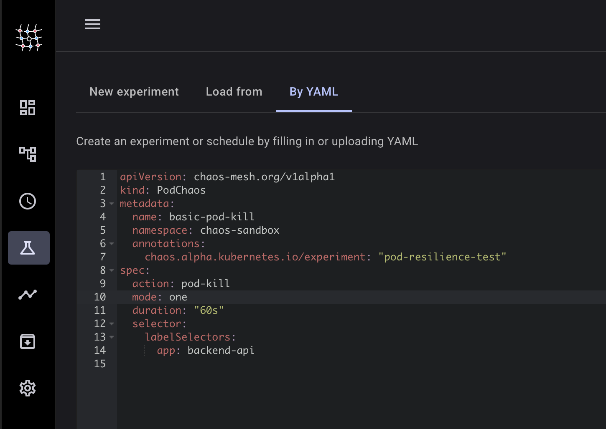

# Building Resilience Through Chaos: Chaos Engineering on AWS EKS

*Chaos engineering practices using Chaos Mesh on Amazon EKS to build more resilient cloud-native applications.*

In cloud-native ecosystem of today, system failures are not a matter of "if" but "when." Traditional testing approaches fall short when dealing with the complexity of distributed microservices architectures. This project demonstrates a chaos engineering implementation that proactively identifies system weaknesses.


Modern distributed systems face unprecedented challenges that make traditional testing approaches insufficient. When we build applications using microservices architecture, we're creating systems with dozens or even hundreds of interconnected services, each communicating across network boundaries. This interconnected nature means that what appears to be a simple user request might actually traverse through multiple services, databases, and external APIs before returning a response.

The network itself becomes a critical component that we can't ignore. Unlike the reliable localhost connections we use during development, cloud networks introduce complexities including latency spikes, packet loss, and intermittent failures. These network conditions vary based on geographic location, time of day, and cloud provider infrastructure health - factors that are nearly impossible to reproduce in traditional testing environments.

Perhaps most challenging are the hidden dependencies that lurk within our systems. During normal operation, these dependencies remain invisible, but they reveal themselves at the worst possible moments - during outages. A seemingly independent service might secretly depend on a shared cache, a common database connection pool, or an external API that everyone assumed was "just for reporting." These hidden connections create cascading failure scenarios that can bring down entire application stacks.

Here's the thing - what if you could experience all these failures... during office hours... with coffee in hand... in a controlled sandbox where you can't accidentally nuke production? That's chaos engineering done right.

Netflix pioneered this with their famous Chaos Monkey - literally a tool that randomly terminates instances in production. But they didn't start by breaking everything. They started small, controlled, and safe. That's what we're doing today.

Rather than waiting for these failures to surprise us in production, chaos engineering takes a proactive approach by introducing controlled failures in safe environments. 

The primary goal is to identify system weaknesses before they cause outages that impact users and revenue. By deliberately introducing failures in controlled environments, we discover brittle components, inadequate error handling, and missing redundancy before these issues manifest during critical business moments. 

Beyond identifying problems, chaos engineering builds confidence in our system's resilience and recovery procedures. When we've successfully tested our application's ability to handle database failures, network partitions, and service outages, we approach production deployments and maintenance windows with confidence rather than anxiety. 

The practice also improves our incident response timelines. When a real outage occurs, teams that have regularly practiced handling similar failures through chaos engineering respond faster and more effectively. They've already seen similar failure modes, know which metrics to check first, and have muscle memory for the recovery procedures. This preparation reduces panic and improves decision-making during high-stress incidents.


### Infrastructure as Code Approach

Our Environment will be spun up using terraform.
Doing so ensures reproducible, version-controlled, and auditable infrastructure deployments that can be easily replicated.


### Lessons from Implementation

When building this chaos engineering environment, several critical decisions shaped both the success of our experiments and the time required to get everything working.

**The Container Runtime**
The first major challenge came from an assumption about container runtimes. Initially, I expected to use Docker as the container runtime since it's what most developers are familiar with locally. However, Amazon Linux 2023 uses containerd by default, not Docker. This difference is critical because Chaos Mesh needs direct access to container runtime sockets to perform its experiments.


**The Spot Instance**
For the compute resources, I chose AWS Spot instances, which provide up to 90% cost savings compared to on-demand instances. This decision might seem risky for infrastructure that's meant to test reliability, but it aligns with chaos engineering principles. Since our experiments are specifically designed to handle node failures and pod disruptions, using Spot instances - which can be terminated at any time - adds an extra layer of realistic chaos to our environment.

This choice makes chaos engineering accessible from a cost perspective. You can run extensive experiments without worrying about significant infrastructure bills. However, for production chaos testing, I would recommend using on-demand instances to ensure that your chaos experiments aren't interrupted by AWS reclaiming your Spot capacity during critical tests.


**Identity and Access Management**
Rather than embedding AWS credentials into containers or using shared service accounts, I implemented IAM Roles for Service Accounts (IRSA). This wasn't just a security best practice - it was essential for chaos engineering scenarios where we need fine-grained control over what experiments can access which AWS resources.

IRSA enables secure integration with AWS services during chaos experiments without the operational overhead of managing embedded credentials. When chaos experiments need to interact with CloudWatch metrics, or when monitoring tools need to access AWS APIs, IRSA provides the secure foundation that makes these integrations possible without compromising on security.

## Demo Application Architecture 

### Multi-Tier Application Design

Rather than using a simple single-service application, let's work with a multi-tier system that in some way mirrors microservices environments. This design choice is important for chaos engineering experiments.


Let's walk through how each tier of our application was designed to reveal different aspects of system resilience.

**Building the Frontend Tier**
For the frontend tier, we chose nginx with exactly two replicas, and this number wasn't arbitrary. With two replicas, we can demonstrate basic high availability - if one frontend pod fails, the other can continue serving traffic. But we deliberately didn't use more replicas because we want to be able to observe load distribution effects during our chaos experiments.

nginx was the natural choice here because it mirrors what most production systems use for reverse proxying and load balancing. More importantly, nginx gives us realistic timeout configurations that we can tune and test. When we introduce latency in our backend services, the frontend's proxy timeouts become critical - too short and users see errors, too long and the user experience suffers. This tier lets us test these real-world timeout scenarios.

From a chaos engineering perspective, the frontend tier is where user experience issues first manifest. When we kill backend pods or introduce network delays, this is where we'll observe whether our system gracefully handles failures or passes errors directly to users. The frontend serves as our canary for user-facing problems.

**Designing the Backend API**
The backend tier runs three replicas of Apache httpd, and this configuration creates several interesting testing scenarios. With three replicas, we can kill one pod and still have two thirds of our capacity available. This allows us to test partial service degradation - a common scenario where some capacity is lost but the service continues operating.

Apache httpd might seem like an unusual choice for a modern API, but it actually provides excellent configurability for response characteristics. We can easily modify response times, simulate different load patterns, and create predictable behavior that makes our chaos experiments more meaningful. In a real implementation, this would be your actual API services, but httpd gives us a realistic proxy for testing service discovery and load balancing behaviors.

The three-replica configuration is particularly valuable for testing circuit breaker patterns. When one replica becomes unhealthy, we want to see how quickly the system routes traffic away from it and how it behaves when the replica recovers. These are fundamental patterns that every distributed system needs to handle correctly.

**Creating the Database Tier - The Intentional Bottleneck**
The database tier runs as a single Redis instance, and this is an intentional design choice that might seem counterintuitive. In production, you'd never run a critical database with no redundancy, but for chaos engineering, this single point of failure serves a crucial testing purpose.

This single database replica creates cascading failure scenarios that reveal how well our application handles data layer problems. When we partition the network to isolate the database, both frontend and backend tiers must gracefully handle the inability to read or write data. This tests whether our services can provide degraded functionality or if they simply crash when data access fails.

Redis was chosen because it provides fast, observable operations that make it easy to see the immediate effects of our chaos experiments. 

The single replica design also forces us to think about connection pooling, retry logic, and graceful degradation strategies. In a properly designed system, temporary database unavailability shouldn't bring down the entire application - it should trigger fallback behaviors, cached responses, or appropriate error messages to users.


## Chaos Engineering Experiment


Each chaos experiment is designed with specific learning objectives and real-world relevance. Rather than randomly breaking things, these experiments target known failure modes that occur in distributed systems. We'll start with the most fundamental failure mode - pod failures - before moving to more complex network scenarios.


## Technical Stack
- **Infrastructure:** AWS EKS, Terraform
- **Chaos Platform:** Chaos Mesh 
- **Container Runtime:** containerd
- **Monitoring:** kubectl, curl, custom scripts
- **Languages:** YAML, Bash, HCL

### Prerequisites
- EKS cluster (1.30+) with containerd runtime
- kubectl configured
- Helm 3 installed

### Quick Setup 
 
1. **Deploy Infrastructure** using either of the two options

Quick Cluster with eksctl

```bash
# Create an EKS cluster with containerd 
eksctl create cluster \
  --name chaos-engineering-lab \
  --version 1.31 \
  --region us-east-1 \
  --nodegroup-name chaos-workers \
  --node-type t3.medium \
  --nodes 3 \
  --nodes-min 2 \
  --nodes-max 4 \
  --managed \
  --spot  # Save money with spot instances!

```
or using Terraform

   ```bash
   cd terraform/
   terraform init && terraform apply
   ```


Connect to Your Cluster

```bash
# Update kubeconfig
aws eks update-kubeconfig --region us-east-1 --name chaos-engineering-lab

# Verify you're connected
kubectl get nodes

# Check the containerd socket path (this is important!)
kubectl get nodes -o wide
# Note: EKS nodes use containerd at /run/containerd/containerd.sock
```


2. **Create Isolated Sandbox Environment**

First, let's create an isolated sandbox environment for our chaos experiments:

```bash
# Create the chaos-sandbox namespace for our test applications
kubectl create namespace chaos-sandbox

# Label it clearly so everyone knows what it's for
kubectl label namespace chaos-sandbox purpose=chaos-experiments
kubectl label namespace chaos-sandbox environment=sandbox
kubectl annotate namespace chaos-sandbox chaos-mesh.org/inject=enabled
```

3. **Install Chaos Mesh with Security Controls**

```bash
# Create the chaos-mesh namespace for the chaos infrastructure
kubectl create namespace chaos-mesh

# Install Chaos Mesh with containerd configuration
helm repo add chaos-mesh https://charts.chaos-mesh.org
helm install chaos-mesh chaos-mesh/chaos-mesh \
  --namespace chaos-mesh \
  --set chaosDaemon.runtime=containerd \
  --set chaosDaemon.socketPath=/run/containerd/containerd.sock \
  --set controllerManager.enableFilterNamespace=true \
  --set controllerManager.targetNamespace=chaos-sandbox

> **Note:** Chaos Mesh runs in the `chaos-mesh` namespace (control plane), but experiments only affect workloads in the `chaos-sandbox` namespace thanks to RBAC and the target namespace filter.

# Verify installation
kubectl get pods -n chaos-mesh -w
```


4. **Implement Namespace Safety Fence (Curated RBAC)**

This keeps chaos experiments centralized in `chaos-mesh` while limiting impact to `chaos-sandbox` only.

```bash
# Ensure the sandbox namespace exists
kubectl get namespace chaos-sandbox || kubectl create namespace chaos-sandbox

# Create the service account used for dashboard auth and API calls
kubectl create serviceaccount chaos-manager -n chaos-sandbox

# Apply curated RBAC
kubectl apply -f rbac/chaos-manager-cluster-role.yaml
kubectl apply -f rbac/chaos-sandbox-manager-role.yaml
kubectl apply -f rbac/chaos-rbac-bindings.yaml

# Generate a limited-scope token (2 hours duration)
kubectl create token chaos-manager -n chaos-sandbox --duration=2h
```

This configuration ensures that:
- Chaos CRs are created/read in `chaos-mesh`, but selectors limit actions to `chaos-sandbox`
- The service account only has write in `chaos-sandbox` and read-only where needed
- The dashboard has the minimum visibility to work well without cluster-admin


5. **Deploy Test Application to Sandbox**
   ```bash
   # Deploy our multi-tier application to the chaos-sandbox namespace
   kubectl apply -f enhanced-test-app.yaml -n chaos-sandbox
   
   # Verify deployment
   kubectl get pods -n chaos-sandbox
   kubectl get services -n chaos-sandbox
   ```

6. **Set Up Dashboard Access with Limited Permissions**
   ```bash
   # Forward the Chaos Mesh dashboard
   kubectl port-forward -n chaos-mesh svc/chaos-dashboard 2333:2333
   # Access at http://localhost:2333
   ```

When you visit http://localhost:2333, use the limited-scope token for `ServiceAccount chaos-manager` generated in step 4. The dashboard will show that you can only create experiments targeting the `chaos-sandbox` namespace - this is our safety fence in action!


The Chaos Mesh dashboard provides visual experiment management with:
- Point-and-click experiment creation
- Experiment monitoring  
- Historical experiment analysis


Now let's deploy our application for the test


### 1. Pod Failure Testing 

We need to understand how our application handles the most basic failure mode: losing individual pods. This is where every chaos engineering journey should begin with regards to k8s because pod failures happen constantly in production environments - during deployments, node maintenance, resource exhaustion, or simple container crashes.

**Why Start Here:** Pod failures are predictable, easy to understand, and provide immediate observable results. When you kill a pod, you'll immediately see whether your application can handle the loss gracefully or if it causes user-facing problems. This experiment builds confidence in both your application's resilience and your chaos engineering process.

```yaml
apiVersion: chaos-mesh.org/v1alpha1
kind: PodChaos
metadata:
  name: basic-pod-kill
  namespace: chaos-mesh
  annotations:
    chaos.alpha.kubernetes.io/experiment: "pod-resilience-test"
spec:
  action: pod-kill
  mode: one                     # Kill only one pod at a time
  duration: "60s"               # Run for 1 minute to observe recovery
  selector:
    namespaces:
      - chaos-sandbox
    labelSelectors:
      app: backend-api           # Target our backend services
  # The killed pod should be recreated automatically by the Deployment
```

Chaos mesh provides multiple ways to start an experiment, let's explore using the dashboard by adding a YAML file directly 



it automatically fills the experiment sections with the detauls mentioned within the yaml manifest


After submitting the experiment, you can monitor its progress directly in the dashboard:


**What You'll Observe During This Test:**


When you execute this experiment, watch for several key behaviors that indicate system health. First, the targeted pod will terminate immediately, and Kubernetes should automatically create a replacement pod within seconds. During this brief window, you'll want to monitor whether your frontend can still serve requests or if users experience errors.

Pay attention to your service's load balancing behavior. Since we have three backend replicas, losing one shouldn't cause service disruption. However, you might notice a temporary increase in response times as the remaining pods handle the full load. This is normal and expected behavior.

Most importantly, observe the replacement pod's startup time. If your container takes too long to become ready, users might experience a longer service degradation period. This experiment often reveals the importance of optimizing container startup times and implementing proper health checks.

**Scenarios This Simulates:**

Pod failures happen in production for numerous reasons, and understanding these scenarios helps you appreciate why this test is so valuable. During rolling deployments, Kubernetes intentionally terminates old pods while starting new ones - essentially the same process we're testing here. Node maintenance or failures cause all pods on that node to terminate suddenly, just like our experiment but potentially affecting multiple pods simultaneously.

Application bugs can also cause containers to crash and restart. By deliberately killing pods, we're testing whether your application state is properly externalized and whether stateless design principles are correctly implemented.


### 2. High Latency API Simulation 

Simulates the issue where external API dependencies become slow, causing cascading delays throughout the application stack.

```yaml
apiVersion: chaos-mesh.org/v1alpha1
kind: NetworkChaos
metadata:
  name: api-high-latency
  namespace: chaos-mesh
  annotations:
    chaos.alpha.kubernetes.io/experiment: "high-latency-api"
spec:
  action: delay
  mode: all                    # Affect all frontend pods
  duration: "120s"             # 2 minutes for observation
  selector:
    namespaces:
      - chaos-sandbox
    labelSelectors:
      app: frontend-app         # Target frontend pods
  delay:
    latency: "500ms"           # Half-second delay - users notice this
    correlation: "90"          # 90% of packets affected (realistic)
    jitter: "100ms"            # ±100ms variance for realism
  direction: to                # Only outgoing traffic (to backend)
  target:
    mode: all
    selector:
      namespaces:
        - chaos-sandbox
      labelSelectors:
        app: backend-api        # Only affect traffic to backend
```
# Verify its execution and status 

kubectl -n chaos-mesh describe networkchaos api-high-latency


# also from dashboard


# End-to-end latency increase on /api/: This proves the delay “to backend” is applied.

```yaml
kubectl -n chaos-sandbox port-forward svc/frontend-service 8080:80 & PID=$!
```
before  


after running


### 3. Packet Loss Scenarios 

Simulates network reliability issues common in cloud environments

```yaml
apiVersion: chaos-mesh.org/v1alpha1
kind: NetworkChaos
metadata:
  name: packet-loss-scenario
  namespace: chaos-mesh
  annotations:
    chaos.alpha.kubernetes.io/experiment: "packet-loss"
spec:
  action: loss
  mode: one                    # Affect one backend pod at a time
  duration: "90s"              # 1.5 minutes observation window
  selector:
    namespaces:
      - chaos-sandbox
    labelSelectors:
      app: backend-api
  loss:
    loss: "15"                 # 15% packet loss 
    correlation: "50"          # 50% correlation 
  direction: both              # Affect both request and response traffic
```

```bash
for i in {1..10}; do
  echo "Request $i:"
  curl --max-time 5 -sS -o /dev/null -w "Response time: %{time_total}s, HTTP code: %{http_code}\n" http://localhost:8080/api/ || echo "FAILED"
  sleep 1
done
```
before  


after 


Still using the same 
  - Successful requests: Response time: 0.348s, HTTP code: 200
  - Failed requests: Operation timed out after 5002ms, HTTP code: 000

### 4. Network Partitioning (Split Brain)

Network isolation between services, simulating severe network failure mode where services cannot communicate at all.

```yaml
apiVersion: chaos-mesh.org/v1alpha1
kind: NetworkChaos
metadata:
  name: database-partition
  namespace: chaos-mesh
  annotations:
    chaos.alpha.kubernetes.io/experiment: "database-isolation"
spec:
  action: partition
  mode: all                    # Isolate all database instances
  duration: "120s"              # Short duration - this breaks the app
  selector:
    namespaces:
      - chaos-sandbox
    labelSelectors:
      app: database             # Target database pods
  direction: both              # isolate database
  target:
    mode: all
    selector:
      namespaces:
        - chaos-sandbox
      labelSelectors:
        app: backend-api        # From backend API pods
```


after running 


  - 100% failure rate - All requests should fail or timeout
  - Long response times (up to 10s) as the backend can't reach the
  database
  - Complete application breakdown - this simulates total database
  outage

### 5. Progressive Degradation 

Simulates gradual performance degradation that often occurs in production as systems come under increased load.

```yaml
apiVersion: chaos-mesh.org/v1alpha1
kind: NetworkChaos
metadata:
  name: progressive-delay
  namespace: chaos-mesh
  annotations:
    chaos.alpha.kubernetes.io/experiment: "progressive-degradation"
spec:
  action: delay
  mode: all                    # Affect all backend pods
  duration: "300s"             # 5 minutes total observation
  selector:
    namespaces:
      - chaos-sandbox
    labelSelectors:
      app: backend-api
  delay:
    latency: "50ms"            # Start with small delay
    correlation: "100"         # Affect all traffic for consistency
    jitter: "10ms"             # Small jitter in intervals
  direction: both              # Affect both directions

  # For progressive testing, you'd run multiple experiments
  # with increasing latency values: 100ms -> 500ms -> 1000ms -> 3000ms
```

Each phase helps identify different threshold points where user experience and system behavior changes.


## Best Practices Learned Through Real Implementation

When you begin your chaos engineering journey, the temptation is to create dramatic failures to see spectacular results. However, I learned that starting small is absolutely essential for building confidence and understanding. Begin with experiments that last just 30-60 seconds and affect only one pod at a time. This approach lets you observe the impact without causing significant disruption, and more importantly, it helps your team build trust in the chaos engineering process.

During one of my early tests, I jumped straight into a 10-minute network partition experiment without proper preparation. The result was panic among team members who thought we had a real outage, and confusion about whether the observed problems were from our experiment or genuine issues. Starting small teaches you the blast radius of each type of failure and builds confidence progressively.

Before introducing any chaos, establish a comprehensive baseline of your system's normal behavior. Run your monitoring script multiple times throughout different periods to understand typical response times, error rates, and resource usage patterns. This baseline becomes your reference point - without it, you won't know if that 200ms response time during chaos is actually a problem or just normal variance.

I discovered this the hard way when running my first latency experiment. Without a baseline, I couldn't tell if the increased response times were from my 500ms delay injection or just natural variation due to time of day. Now I always run baseline tests at different times and document the normal ranges before any chaos introduction.

One critical lesson learned through trial and error: always ensure your chaos experiments have automatic termination built in. Set explicit durations in your chaos configurations and verify they're working correctly. During one of my early tests, an experiment without proper duration limits continued running overnight, causing confusion during the morning deployment window.

Every experiment configuration now includes a defined duration, and I verify termination works correctly in our staging environment first. This isn't just about preventing runaway experiments - it's about building confidence that you can control the chaos you introduce.

Documentation might seem like tedious overhead, but capturing findings immediately after each experiment proved invaluable for building organizational knowledge. Create a simple log that records what you tested, what happened, what you learned, and what you'll do differently next time.

When a similar database connectivity issue occurred in production three weeks after our chaos testing, our experiment notes helped us identify and fix the problem in minutes rather than hours. The patterns we'd observed during controlled chaos gave us immediate insight into the production failure. These findings become your organization's playbook for handling real incidents.

As you prepare for production chaos engineering, establish clear safeguards and communication protocols. This means having rollback procedures ready, ensuring all stakeholders are informed about experiment schedules, and most importantly, having an immediate "stop everything" mechanism that can halt all experiments if something goes wrong.

Production chaos engineering isn't about being reckless - it's about controlled, careful testing with multiple safety nets. Every production experiment should have explicit approval, monitoring in place, and a communication plan for what happens if things go sideways. The goal is to learn about failure modes without creating actual outages.

##  Chaos Engineering Future Enhancements

The current implementation provides a solid foundation for chaos engineering, but there are several exciting directions to evolve this into an enterprise-grade chaos engineering platform. The most significant advancement would be integrating with AWS Fault Injection Simulator (FIS), Amazon's native chaos engineering service.

**AWS FIS Integration - The Native AWS Approach**
AWS Fault Injection Simulator represents the next evolution of our chaos engineering practice. Instead of managing Chaos Mesh directly, we can orchestrate chaos experiments through AWS FIS, which provides native integration with AWS services and enhanced safety controls. FIS can directly target our EKS nodes, EC2 instances, and AWS services while providing built-in safeguards and monitoring.

This integration would allow us to simulate failures at the infrastructure level - stopping EC2 instances, throttling EBS volumes, or inducing network latency between availability zones. We could orchestrate complex multi-service failures that span both our Kubernetes workloads and the underlying AWS infrastructure, providing a more comprehensive view of system resilience.

The beauty of AWS FIS is that it integrates with AWS Systems Manager and CloudWatch, giving us enterprise-grade scheduling, monitoring, and rollback capabilities. We could trigger chaos experiments based on deployment events, schedule them during maintenance windows, and automatically halt experiments if key metrics exceed thresholds.

**GitOps-Driven Automation Pipeline**
Building on the FIS foundation, we could implement a GitOps-driven chaos experiment pipeline. Imagine committing chaos experiment configurations to a Git repository, having them automatically validated in staging environments, and then scheduled for production execution during predetermined maintenance windows.

This approach would treat chaos experiments as infrastructure code, with version control, peer review, and automated testing. Teams could propose new chaos scenarios through pull requests, and experiments would be automatically executed across development, staging, and production environments with appropriate safety controls for each.

**Advanced Observability Integration**
The current monitoring approach using simple scripts would evolve into comprehensive observability integration with Prometheus, Grafana, and AWS CloudWatch. We could create chaos engineering dashboards that show real-time experiment impact, historical resilience trends, and automatic correlation between chaos events and system behavior.

This enhanced monitoring would enable automatic experiment termination based on custom metrics, integration with PagerDuty for incident response testing, and detailed reporting on system resilience improvements over time. The observability stack would become a critical component for validating that our chaos engineering efforts are actually improving system reliability.

**Multi-Region and Cross-Service Chaos**
Expanding beyond single-region testing, we could implement cross-region failure scenarios that test disaster recovery procedures and data replication strategies. Using AWS FIS, we could simulate entire availability zone failures, regional service degradations, and cross-region network partitions.

This would enable testing of our most critical failure scenarios - the ones that could actually impact business operations significantly. We could validate that our multi-region architectures truly provide the resilience they're designed for, and identify hidden dependencies that only surface during major infrastructure failures.

**Application-Level Resource Chaos**
While our current focus is on network and pod failures, the next phase would include systematic testing of resource exhaustion scenarios. Using both Chaos Mesh and AWS FIS, we could simulate CPU exhaustion, memory pressure, disk I/O bottlenecks, and network bandwidth limitations across both container and instance levels.

This comprehensive resource chaos testing would help optimize our resource allocation strategies, validate auto-scaling configurations, and ensure that resource constraints in one part of the system don't cause cascading failures elsewhere. The combination of container-level and infrastructure-level resource chaos would provide complete coverage of potential resource-related failure modes.

## Conclusion

This chaos engineering implementation demonstrates how controlled failure injection can reveal system weaknesses before they impact users. By combining infrastructure as code, realistic test scenarios, and simple monitoring, teams can build confidence in their distributed systems' resilience.

The key insight: chaos engineering isn't about breaking things—it's about learning how systems fail so you can make them stronger.

---

